*Read this in other languages: [English](README.md).*

# Hyperledger ブロックチェーン上の IoT 資産トラッカー

IoT 資産追跡ワークショップのこのセクションは、実際には2つの部分に分かれています。
最初の部分は **ブロックチェーン Aパート** と呼ばれ、IBM Cloud 上の [IBM Blockchain Starter Plan](https://www.ibm.com/blockchain/getting-started.html) に [Hyperledger](https://www.hyperledger.org/) Fabric と Hyperledger Composer をデプロイするチュートリアルに従います。

優れた IBM Blockchain チュートリアルが幾つか存在しますが、ここではこれを繰り返すつもりはありません。
私たちは道に沿って、それらを組み合わせて使用します。
**ブロックチェーン Aパート** では、生鮮品のブロックチェーンビジネスネットワークを構築します。

**ブロックチェーン Bパート** では、それを IBM Blockchain Starter Plan に展開するためにスマートコントラクトに変換します。
DevOps という IBM Cloud の一部を使用して、コードを作成し、IBM Blockchain Starter Plan のインスタンスにデプロイします。
構築プロセスでは、Cloudly Foundry サービスとして動作する Hyperledger Composer Rest Server も IBM Cloud に導入します。
Hyperledger Composer REST API は、Node-RED によってブロックチェーンの生鮮品のネットワークと通信するために使用されます。
最後に、Node-RED を操作して対話し、資産のトラッキングを視覚的に表示します。

## ブロックチェーン Aパート: 生鮮品ネットワークを構築

私たちは生鮮品ネットワークを構築するために Hyperledger Composer Playground を使用します。
作業が完了したら、パートBで使用するコードをローカルシステムにエクスポートします。

### 生鮮品ネットワークのサンプルを Hyperledger Composer Playground にインポート

1. [IBM Hyperledger Composer Playground](https://blockchaindevelop.mybluemix.net/test) にアクセスします。
2. `Deploy a new business network` をクリックします。
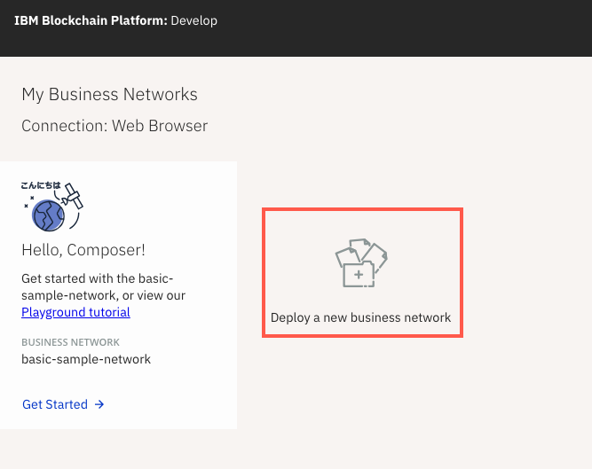
3. 下にスクロールして、npm のサンプルから `perishable-network` を選択します。
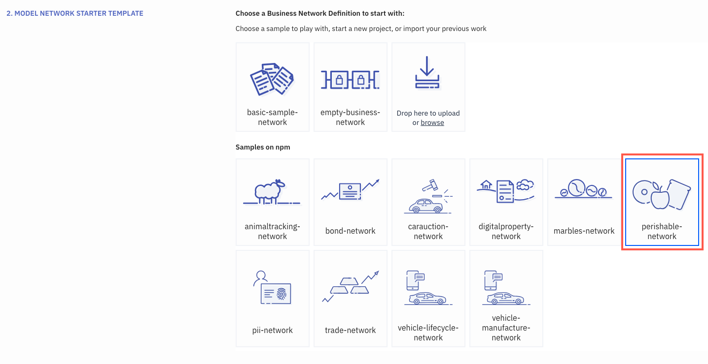
4. 上にスクロールすると、ビジネスネットワークの名前は `perishable-network` になります。
5. `Give the network admin card` に名前 **admin@perishable-network** を指定します。
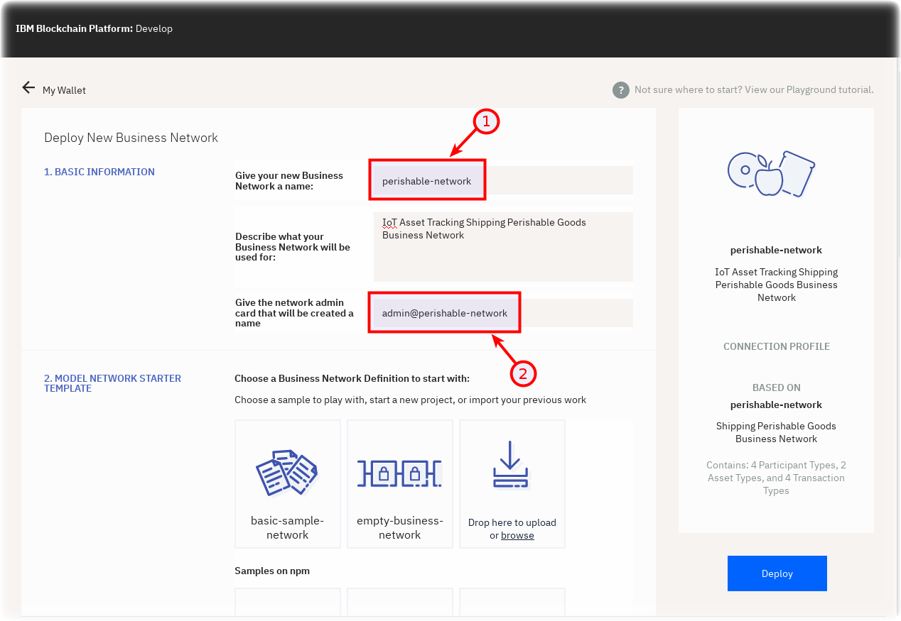
6. 右側のサイドバーで、**Deploy** をクリックします。
7. **Connect now ->** をクリックします。

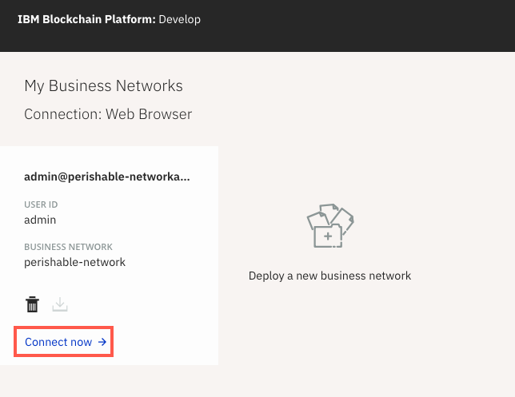

### IoT トラッキングのための生鮮品ネットワークをカスタマイズする

導入した生鮮品ネットワークを見直してみましょう。
これは温度を追跡しますが、地理情報は追跡しません。
developerWorksには、生鮮品ネットワークを紹介する優れた3つの Hyperledger シリーズの記事があります。

* [Hyperledger Composer basics, Part 1 - Model and test your blockchain network](https://www.ibm.com/developerworks/cloud/library/cl-refine-deploy-your-blockchain-network-with-hyperledger-composer-playground/index.html)
* [Hyperledger Composer basics, Part 2 - Refine and deploy your blockchain network](https://www.ibm.com/developerworks/cloud/library/cl-refine-deploy-your-blockchain-network-with-hyperledger-composer-playground/index.html)
* [Hyperledger Composer basics, Part 3 - Deploy locally, interact with, and extend your blockchain network](https://www.ibm.com/developerworks/cloud/library/cl-deploy-interact-extend-local-blockchain-network-with-hyperledger-composer/index.html)

Part 2 記事は手順を含んでいます

> 次に、パート1で作業した生鮮品ネットワークのサンプルを変更します。具体的には、船積みアセットに GPS 読み取り値を追加して IoT GPS センサーを出荷コンテナにモデル化し、スマートコントラクト (チェーンコード) が発送先ポートに到着したときにアラートを送信します。

ええ、これはまさに **私たちがしたいこと** です。
素晴らしい！
Steve Perry の [perishable-network git repository](
https://github.com/makotogo/developerWorks) には、彼が dW の記事で詳しく述べた内容のバリエーションを含んでいます。

もちろん、これら紹介したサンプルは私にとって完全なものではありません。
なぜなら、Particle Electron 資産トラッカーから加速度計データもクラウドに送信したいからです。

Hyperledger Blockchain モデリング言語の CTO ファイルとチェーンコードについて少し学ぶ必要があります。
dW シリーズのパート1(上のリンク)は良い教材です。

次のステップでは、モデルファイルを変更して、加速度計データ、環境データ、地理位置データ、タイムスタンプを追加します。
IoT データに追加するには、追加のトランザクションも必要です。
モデルファイル更新後の時間を節約したい場合は、クローンしたリポジトリからトランザクションをインポートしてください。

1. モデルファイルで、**enum CompassDirection** を見つけるまでスクロールします。 次の値を入力して、4つの基本的な方向 (東西南北) を列挙します。
```
/**
 * Directions of the compass
 */
enum CompassDirection {
  o N
  o S
  o E
  o W
}
```
2. 現在、センサーからデータを取得するためには、いくつかのトランザクションモデルが必要です。 空の **ShipmentTransaction を継承 (拡張) した AccelReading トランザクション** を完成するため、次の情報を入力します:
```
transaction AccelReading extends ShipmentTransaction {
  o Double accel_x
  o Double accel_y
  o Double accel_z
  o String latitude
  o String longitude
  o String readingTime
}
```
3. **ShipmentTransaction を継承した TemperatureReading トランザクション** に対しては、以下の変数に一致するように変更します:
```
transaction TemperatureReading extends ShipmentTransaction {
  o Double celsius
  o String latitude
  o String longitude
  o String readingTime
}
```
4. **ShipmentTransaction を継承した GpsReading トランザクション** を設定するときです:
```
transaction GpsReading extends ShipmentTransaction {
  o String readingTime
  o String readingDate
  o String latitude
  o CompassDirection latitudeDir
  o String longitude
  o CompassDirection longitudeDir
}
```

5. IoTデータを資産、出荷に関連付けるには、IoT関連の変数を出荷するための資産モデルに追加する必要があります。出荷モデルに以下の追加を行います。
<ul>
<li>AccelReading[] AccelReadings optional</li>
<li>GpsReading[] gpsReadings optional</li>
</ul>
```
asset Shipment identified by shipmentId {
  o String shipmentId
  o ProductType type
  o ShipmentStatus status
  o Long unitCount
  --> Contract contract
  o TemperatureReading[] temperatureReadings optional
  o AccelReading[] AccelReadings optional
  o GpsReading[] gpsReadings optional
}
```

6. 我々の契約は、現在、加速度計によって捕捉された事故なしに到着する出荷を前提としたものです。
加速度計値のフィールドを契約 (Contract) 資産モデルに追加する必要があります。
これにより、logic.js ファイルの加速度計データに基づいて、衝突、ひどい揺れ、その他のインシデントの条件を指定することができます。
<ul>
<li>Contract 資産モデルに **Double maxAccel** を追加する。</li>
</ul>
```
asset Contract identified by contractId {
  o String contractId
  --> Grower grower
  --> Shipper shipper
  --> Importer importer
  o DateTime arrivalDateTime
  o Double unitPrice
  o Double minTemperature
  o Double maxTemperature
  o Double minPenaltyFactor
  o Double maxPenaltyFactor
  o Double maxAccel
}
```
7. ここで、いくつかのイベントを作成して、合意されたしきい値を超えた場合に、適切な参加者に警告する必要があります。下にスクロールして、**TemperatureThresholdEvent** に次の情報を入力します。
```
event TemperatureThresholdEvent {
  o String message
  o Double temperature
  o String latitude
  o String longitude
  o String readingTime
  --> Shipment shipment
}
```

8. **AccelerationThresholdEvent** に変数を作成します:
```
event AccelerationThresholdEvent {
  o String message
  o Double accel_x
  o Double accel_y
  o Double accel_z
  o String latitude
  o String longitude
  o String readingTime
  --> Shipment shipment
}
```
9. **ShipmentInPort** イベントのモデルを作成するための情報を記入します:
```
event ShipmentInPortEvent {
  o String message
  --> Shipment shipment
}
```

10. モデルファイルが完成しました。`Update` をクリックすると、Hyperledger Composer Playground に変更が保存されます。


11. 私たちの新しい logic.js ファイルの内容を私たちの [リポジトリ](IoT-Perishable-Network/lib/logic.js) から **コピー** (CTRL+C) します。

12. Hyperledger Composer Playground に戻り:
<ul>
<li>logic.js ファイルの内容を **全て選択** (CTRL+A) して削除します</li>
<li>さきほどリポジトリの logic.js ファイルからコピーした内容を **ペースト** (CTRL+V) します</li>
<li>`Update` をクリックして変更を保存します</li>
</ul>


13. さあ、私たちの仕事をテストしましょう！ページの上部にある `Test` タブをクリックします。


14. まず、`Submit Transaction` を選択することで、*setupDemo* トランザクションを実行してデフォルト値を与えることができます。


15. ドロップダウンから `SetupDemo` を選択して `Submit` します。
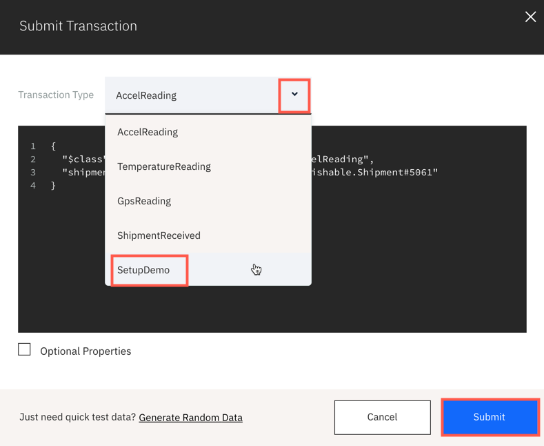

16. あなたの3つの参加者と2つの資産を見てください。栽培業者(Grower)、輸入業者(Importer)、荷送人(Shipper)、貨物(Shipment)および契約(Contract)が定義されているはずです。

17. 他の取引と一緒に実行して、資産を更新するようにします。以下の例のように、貨物に追加された項目が詳細に表示されます。任意のデータを入力できます。架空のものでかまいません。
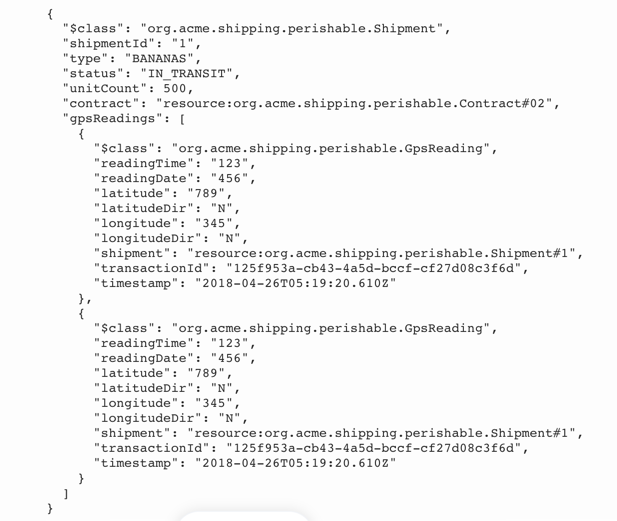

18. デプロイメントの実行中に使用するため、コードをローカルシステムに `Export` します。
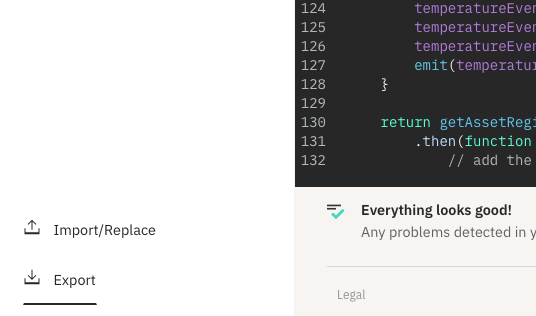

19. ビジネスネットワークアーカイブ、**perishable-network.bna** ファイルをどこか簡単に見つけられる場所に保存します。


## ブロックチェーン Bパート: 生鮮品ネットワークの実装

さあ楽しい時間が始まります！これを2つのセクションに分けて説明します:

* [ブロックチェーン・ネットワークを IBM Blockchain Starter プランにデプロイする](#deploy-your-network)
* [Hyperledger Composer Rest Server を使用して、デプロイしたブロックチェーン・ネットワーク用の API を生成する](#working-with-the-rest-api)

<a name="deploy-your-network"></a>
### 自身のネットワークをデプロイする

自身のブロックチェーン・アプリケーションを作成したので、今度は IBM Blockchain Starter プランで実行させましょう。
そのために、IBM Cloud の DevOps サービスを使用してコードをデプロイし、REST サーバーを開始します。
別の機会に同様のことをする場合、この全プロセスは [こちら](https://github.com/sstone1/blockchain-starter-kit/blob/master/README.md) に文書化されていますので参照してください。
このプロセスにより、IBM Blockchain Starter プランが作成されます。

**ノート:** IBM Blockchain Starter プランを使用するには、IBM Cloud アカウントを pay-as-you-go アカウントにアップグレードする必要があります。最大30日間無料です。料金の請求を避けるために使用量を監視するのを忘れないでください。

これは以下の手順に分かれています:
* [DevOps ツールチェーンを作成する](#create-a-devops-toolchain)
* [Hyperledger Composer をローカル環境にインストールする](#install-hyperledger-composer-locally)
* [デプロイのためのコードを準備する](#prepare-your-code-for-deployment)
* [デプロイメントの検証](#verify-deployment)

<a name="create-a-devops-toolchain"></a>
#### DevOps ツールチェーンを作成する
1.  [こちら](https://console.bluemix.net/devops/setup/deploy/?repository=https%3A//github.com/sstone1/blockchain-starter-kit&branch=master&env_id=ibm%3Ayp%3Aus-south) で DevOps ツールチェーン作成を開始する。

2. あなたのツールチェーンの名前を入力してください。ユニークなものにしましょう！

  **Note:** 以前に IBM Cloud で GitHub 認証を実施していない場合は、Blockchain Starter Kit を作成する前に実施する必要があります。この画面をスクロールして認証ボタンを選択してください。

  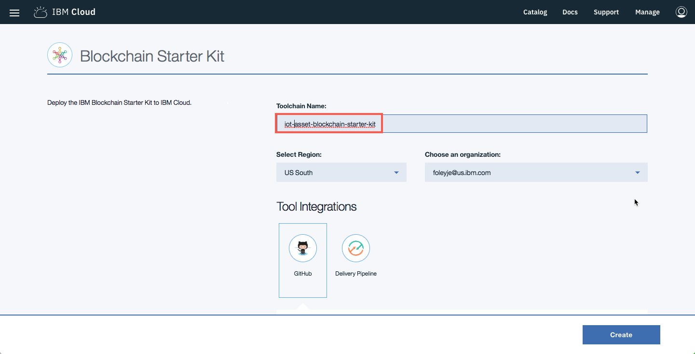

3. 下にスクロールしてユニークなリポジトリ名 **XXX-blockchain-toolkit** を作成します。XXXはあなたの頭文字です。

4. `Create` をクリック。
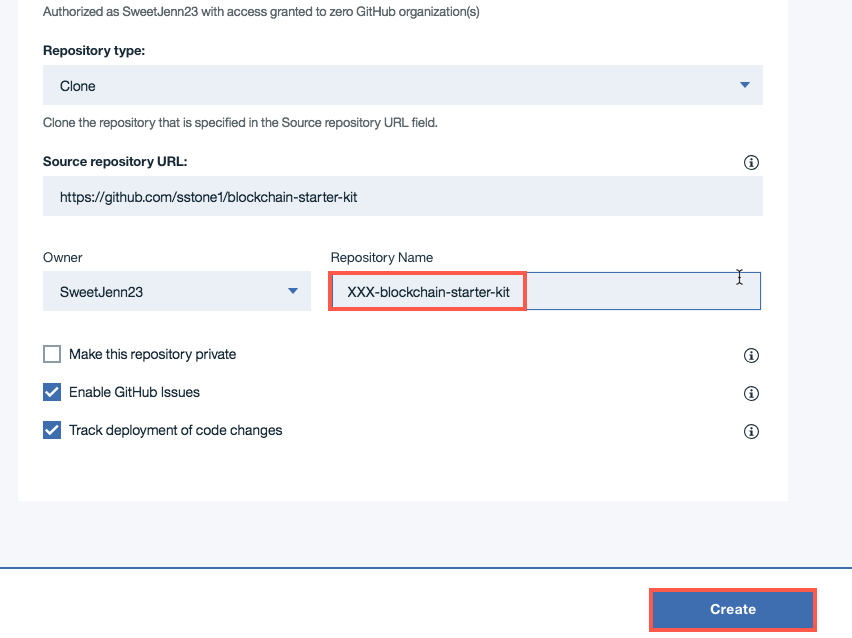

5. おめでとう！コードをデプロイするために使用できる完全なツールチェーンが用意されました。
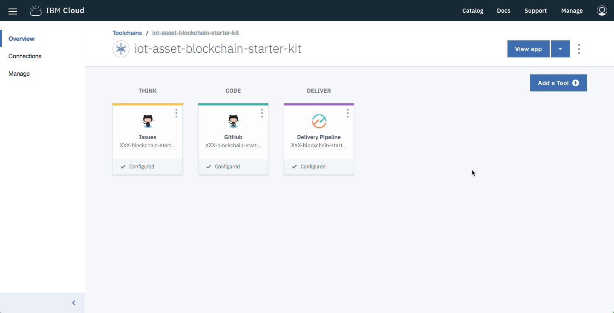

途中の `GitHub` ボタンを押すと、新しく作成した GitHub リポジトリに移動します。この GitHub リポジトリをローカル開発環境にクローンすることで、ブロックチェーンアプリケーションを操作できます。

右側の `Delivery Pipeline` ボタンをクリックすると、DevOps ツールチェーンの配信パイプラインに移動します。ここからは、ブロックチェーンアプリケーションの最新の自動ビルドとデプロイメントの結果を調べることができます。

<a name="install-hyperledger-composer-locally"></a>
#### Hyperledger Composer をローカル環境にインストールする
コードを展開するには、システム上の Hyperledger Composer コマンドのいくつかを使用する必要があります。

1. 前提条件のインストールと Hyperledger Composerの インストールについては、[指示](https://hyperledger.github.io/composer/latest/installing/installing-index) に従ってください。
  * この演習で Hyperledger Composer をインストールする場合は、手順1と手順2のみを完了してください。

<a name="prepare-your-code-for-deployment"></a>
#### デプロイのためのコードを準備する

1. あなたのツールチェインで、`GitHub` アイコンを選択して、新しく作成したリポジトリを開きます。
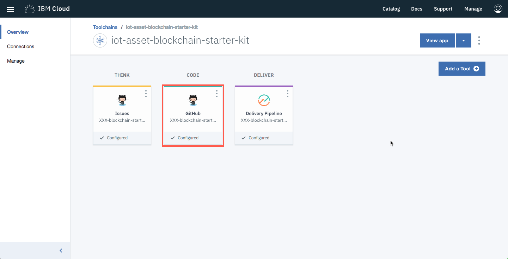

2. GitHubで、`Clone or download` をクリックし、`copy` アイコンをクリックして、リポジトリをローカルシステムにクローンするためのURLを取得します。


3. あなたのローカルシステム上の端末で、 `git clone <URL>` と入力します。`<URL>` は前の手順でコピーした値です。
```
$ git clone https://github.com/SweetJenn23/XXX-blockchain-starter-kit.git
Cloning into 'XXX-blockchain-starter-kit'...
remote: Counting objects: 40, done.
remote: Compressing objects: 100% (35/35), done.
remote: Total 40 (delta 2), reused 40 (delta 2), pack-reused 0
Unpacking objects: 100% (40/40), done.
```

4. `cd XXX-blockchain-starter-kit/contracts` でcontract 契約ディレクトリに移動します。XXXはあなたの頭文字です。

5. 私たちはブロックチェーンネットワーク(.bna)からスマートコントラクトを作成する必要があります。これを行うには、Yeoman と呼ばれる Hyperledger Composer と共にインストールされたツールの1つを使用します。これにより、Hyperledger Fabricに 展開できるスマートスマートコントラクトの雛形 (スケルトン) が作成されます。私たちはこの雛形に私たちの仕事をコピーしなければなりません。

  雛形を作成するには、ローカルシステムの端末に `yo` と入力し、**XXX-perishable-network** という名のビジネスネットワークを作成します。XXXはあなたの頭文字です。プロンプトで残りの情報を入力します。

  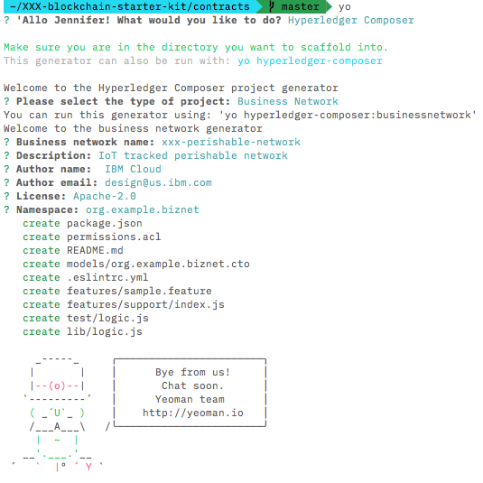

6. コードをスケルトンにコピーするには、ビジネスネットワークアーカイブを展開する必要があります。
   * ローカルシステムの端末で、**perishable-network.bna** を保存したディレクトリに移動します。
   * ファイルの拡張子を変更します: `mv perishable-network.bna perishable-network.zip`
   * ファイルを解凍します: `unzip perishable-network.zip`
```
> unzip perishable-network.zip
Archive:  perishable-network.zip
 extracting: package.json
 extracting: README.md
 extracting: permissions.acl
   creating: models/
 extracting: models/perishable.cto
   creating: lib/
 extracting: lib/logic.js
```
7. */XXX-blockchain-starter-kit/contracts/xxx-perishable-network* に、抽出したファイルをコピーします。*xxx-perishable-network* ディレクトリにあるファイルを同じ名前のファイルで置き換えます。次のすべてのファイルに対してこれを行います:
   * `/xxx-blockchain-starter-kit/contracts/xxx-perisable-network/lib/org.acme.biznet.perishable.cto` を削除
   * `perishable-network/README.md` を `XXX-blockchain-starter-kit/contracts/xxx-perishable-network` にコピー
   * `perishable-network/permissions.acl` を `XXX-blockchain-starter-kit/contracts/xxx-perishable-network` にコピー
   * `perishable-network/models/perishable.cto` を `XXX-blockchain-starter-kit/contracts/xxx-perishable-network/models/` にコピー
   * `perishable-network/lib/logic.js` を `XXX-blockchain-starter-kit/contracts/xxx-perishable-network/lib/` にコピー

   

8. リポジトリの中のファイル **~/XXX-blockchain-starter-kit/.bluemix/pipeline_BUILD.sh** を編集します。

   * **function test_composer_contract** を探す

   * function 定義のなかで `#npm test` の行のコメントを外して **npm test** とする:
```
     function test_composer_contract {
       CONTRACT=$1
       echo testing composer contract ${CONTRACT}
       pushd contracts/${CONTRACT}
       npm install
       #npm test
       rm -rf node_modules
       popd
     }
```

9. ツールチェインの GitHub のリポジトリにコードをコミットするには、端末で **XXX-blockchain-starter-kit** ディレクトリ内で次のコマンドを実行する必要があります:
   * `git add -A`
   * `git commit -m "Update files"`
   * `git push`

   


<a name="verify-deployment"></a>
#### デプロイメントの検証

GitHub にコードをコミットすると、DevOps ツールチェインが自動的に変更を取得します。ツールチェインはすぐに変更のデプロイを開始します。

1. DevOps ツールチェーンページに移動し、`Delivery Pipeline` ボタンをクリックします。以下のページが表示され、デリバリーパイプラインの現在の状態の概要がわかります:
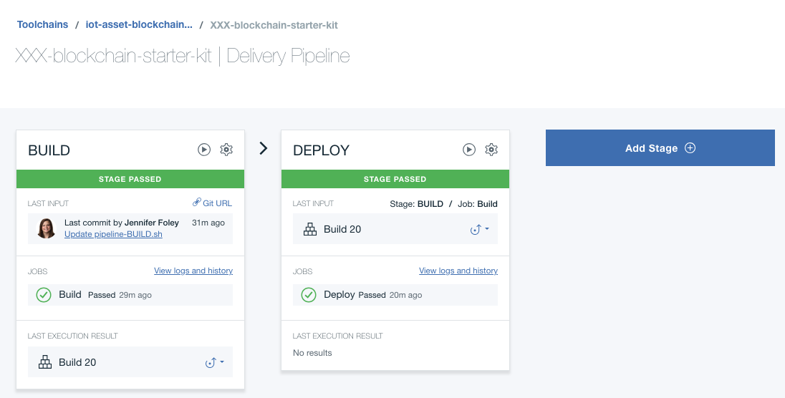

2. デリバリーパイプラインには "BUILD" と "DEPLOY" の2つのフェーズがあります。

デリバリーパイプラインの **BUILD** フェーズは、GitHubリポジトリをクローンし、依存関係をインストールし、すべてのスマートコントラクトの自動化ユニットテストをすべて実行します。ユニットテストが失敗した場合、デリバリーパイプラインは失敗し、変更はデプロイ(DEPLOY)されません。

デリバリーパイプラインの **DEPLOY** フェーズは、スマート・コントラクトを IBM Cloud にデプロイします。
IBM Blockchain Platform: Starter プラン (ブロックチェーンネットワーク) のインスタンス、Cloudant (ブロックチェーン資格情報の保存場所)のインスタンス、スマートコントラクトのデプロイ、デプロイ各スマートコントラクト用の RESTful API サーバーのプロビジョニングと構成を担当します。

`View logs and history` をクリックすると、ビルドの最新ログが表示されます:


BUILD と DELIVERY 両方のフェーズが緑色ならば、エラーが発生していないことを示します。そうでない場合は、ログを使用してエラーの原因を調査する必要があります。

<a name="working-with-the-rest-api"></a>
### Working with the REST API

Node-RED からブロックチェーンを操作するために、Hyperledger Composer REST API を使用して perishable-network ビジネスネットワークを公開します。現在、このスターターキットでは、Hyperledger Fabric を使用して開発されたスマートコントラクト用の RESTful API サーバーはデプロイされていません。Hyperledger Composer を使用しているので、DevOps ツールチェーンは、配備された各スマートコントラクトに対して RESTful AP Iサーバーを自動的にデプロイしました。これらの RESTful API を使用して、スマートコントラクトと対話するエンドユーザー・アプリケーションを構築できます。

1. デプロイされた RESTful API サーバーのURLは、"DELIVERY" フェーズのログで確認できますが、[IBM Cloud Dashboard](https://console.bluemix.net/dashboard/apps) でも見つけることができます。RESTful API サーバーは "composer-rest-server-" という名前とスマートコントラクトの名前で、アプリケーションとしてデプロイされます。 私たちは **composer-rest-server-xxx-perishable-network** という名前を使用します。


2. rest サーバーをクリックして、アプリケーションの詳細ページに移動します。
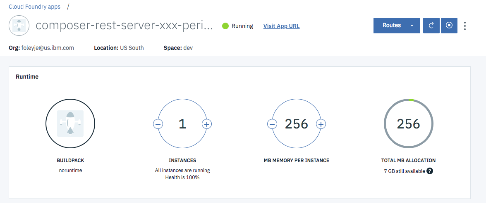

3. `Visit App URL` であなたの API を確認できます。


4. これらのAPIは、Node-RED がブロックチェーンと通信する方法を提供しています。
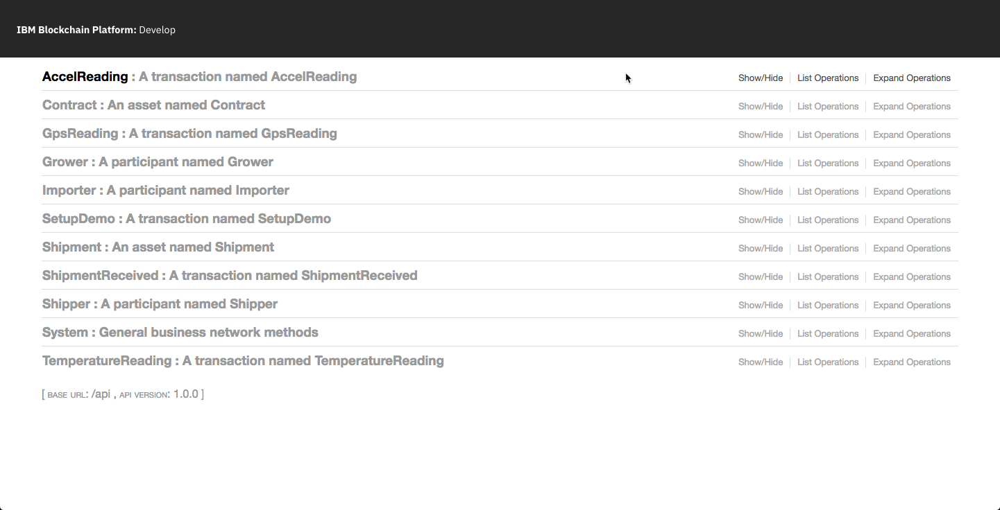

おめでとう！ あなたはワークショップの Blockchain セクションを完了しました。
[Node-RED セクション](../Node-RED/README-ja.md) に進み、
IoT 資産環境センサーのデータをトランザクション履歴に書き込み/読み取り/可視化できるようにした REST API を活用してください。
