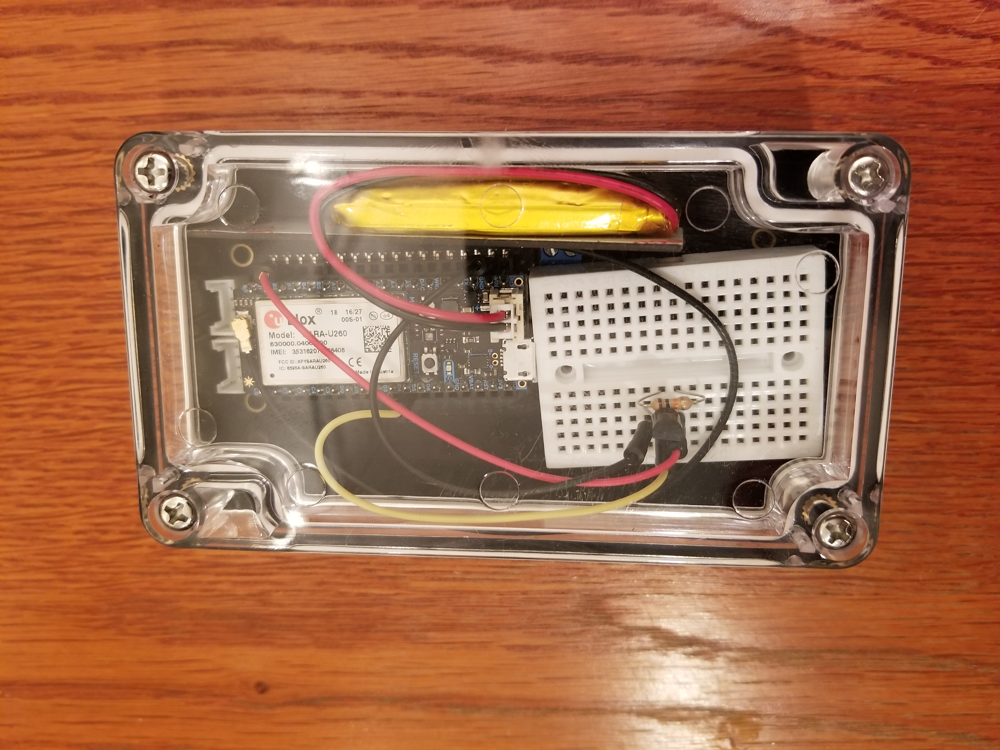
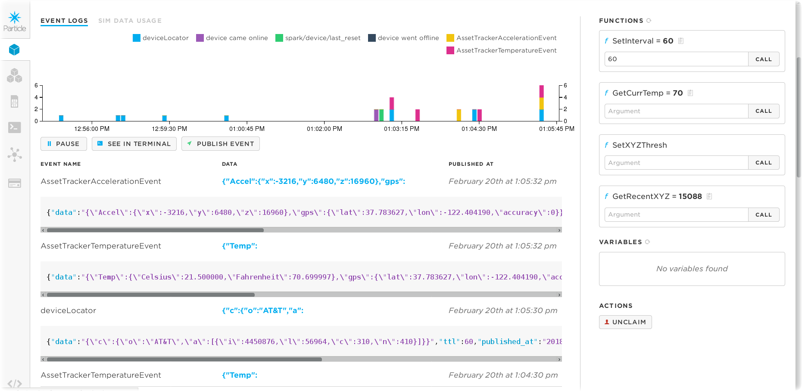

*Read this in other languages: [English](README.md).*

# Particle Electron 資産トラッカー

Particle Electron 資産トラッカーを使用すると、環境センサーデータを収集し、GPSまたはセルラー三角測量を使用してその位置を計算し、両方のデータイベントを Particle Functions を使用して Particle.io コンソールに送信することができます。
物理的なものが過酷な環境条件にさらされた時、**Where、What、When** の情報を知ることにより、多くのビジネスプロセスを改善することができます。

このセクションでは以下を確認します:
* Particle Electron 資産トラッカーのハードウェア構成
* Particle ソフトウェア ツールチェーン
* Watson IoT Asset Tracker プログラムは、温度と加速度計のデータを問い合わせ、クラウドに報告します

## Particle Electron Asset Tracker v2


[Particle Electron Asset Tracker v2](https://store.particle.io/products/asset-tracker) ボードでは、uBlox M8 GNSS GPS レシーバーと Adafruit LIS3DH Triple Axis 加速度計を Particle Electron に接続することができます。
Grove センサーを接続することもできます。

## Particle Electron ソフトウェア ツールチェーン
1. http://login.particle.io/ サイトで自身の Particle.io アカウントを設定する。
2. 自身の Particle Electron を起動し名前をつける。
    * 私の Electron は `blockchain-iot-asset-tracker1` です。
3. SIM を起動する。
4. 自身の Particle Electron を登録すると、[Particle Devices Console](https://console.particle.io/devices) に表示される。
5. Particle.io の提供する [Particle Build WebIDE](https://docs.particle.io/guide/getting-started/build/core/) か CLI コマンドライン toolchain を使用する。
6. 私は [WebIDE](https://build.particle.io/) に関して以下のサンプルを使用して少し学びました:
    * LEDをブレッドボードに配線し、blink-led プログラムで点滅させてみた
    * ウェブ接続の LED サンプルアプリケーションを試してみた
    * Cloud2LED.bin を変更して Particle クラウドから LED の On/Off を Electron に送信してみた。
    私はそれを大文字と小文字を区別しないよう、"on/off" と "ON/OFF" を共に認識するよう簡単な改造をしてみました！

7. [Particle Functions](https://docs.particle.io/reference/firmware/core/#particle-function-) を読むと、イベントを公開して購読できるようになります。
8. 私は Web IDE よりコマンドラインインターフェースを好むので、ガイドに従って、[Particle CLI]( https://docs.particle.io/guide/tools-and-features/cli/electron/) をインストールしました。
```
    $ particle login
    $ particle upgrade
```
 [ファームウェアのアップグレード](https://docs.particle.io/guide/tools-and-features/firmware-manager/electron/) は、Googleマップジオロケーションデバイスのロケータを機能させるために重要でした。私の Particle Electron は v0.4.9 が工場出荷時にインストールされていましたが、v0.6.4にアップグレードすると Google Maps 機能が機能するようになりました。

9. 次のステップとして [$ particle compile]( https://docs.particle.io/reference/cli/#particle-compile) コマンドを学びます。
```
    $ particle compile
```
私の場合は:
```
    $ particle compile electron WatsonIoTAssetTracker --saveTo WatsonIoTAssetTracker.bin
```
10. あなたの Particle プロジェクトで利用できる多くの Arduino 用の [Particle ライブラリ](https://docs.particle.io/guide/tools-and-features/libraries/) があります。
```
$ particle library list
$ particle library view AssetTracker
$ particle library view OneWire
```
11. あなたの Particle Electron を書き換えるためには、 [dfu-util](https://docs.particle.io/faq/particle-tools/installing-dfu-util/core/) をインストールする必要があります。私は Fedora 25 リポジトリにある *dfu-util-0.9-1.fc25.x86_64.rpm* を使用しました。
12. Electron のリセットボタンとモードボタンを押したままにして
    * リセットボタンをはなす
    * LEDが黄色になるのを待つ
    * モードボタンをはなす
13. 最後に、次のコマンドを使用してプログラムをボードに書き込みます:
```
$ particle flash --usb firmware.bin
```  
私の場合は:
 ```
$ particle flash --usb WatsonIoTAssetTracker.bin
 ```
14. プログラムが何をしているかを見るには、[Particle serial](https://docs.particle.io/reference/firmware/photon/#serial) 出力を監視するようにUSBケーブルを設定します。rickkas7 が素晴らしい [Particle serial チュートリアル](https://github.com/rickkas7/serial_tutorial) を書きました。
```
$ particle serial monitor
```

## Watson IoT Asset Tracker プログラム

このリポジトリにある Watson IoT Asset Tracker プログラムの実装を見てみましょう。温度と加速度計のデータを要求し、その位置とともにクラウドに報告します。

このリポジトリで [WatsonIoTAssetTracker.ino](WatsonIoTAssetTracker.ino) コードを取得し、以下のレビューに従ってください。
これは [Particle Simple project](https://docs.particle.io/guide/tools-and-features/libraries/#project-file-structure) ですので、[project.properties](project.properties) ファイルもリポジトリからダウンロードする必要があります。これには、プログラムをコンパイルするために必要なライブラリのリストが含まれています。

### ```void setup()```

この Arduino プログラムのもっとも興味深い点は、 ``setup()`` で、温度と加速度センサーのデータを送信して問い合わせる4つの Particle 関数を宣言しています。

``` C
// Declare a Particle.function so that we can adjust the Asset Tracking on and off reporting interval from the cloud.
Particle.function("SetInterval",AssetTrackerSetReportInterval);

// Declare a Particle.function so that we can query the current temperature from the cloud.
Particle.function("GetCurrTemp",AssetTrackerGetCurrentTemp);

// Declare a Particle.function so that we can adjust the accelerometer threshold from the cloud.
Particle.function("SetXYZThresh",AssetTrackerSetAccelThresh);

// Declare a Particle.function so that we can query recent accelerometer data from the cloud.
Particle.function("GetRecentXYZ",AssetTrackerGetRecentAccel);
```

このプログラムの次の興味深い点は、[Google Maps Locator API](https://docs.particle.io/tutorials/integrations/google-maps/) を使用して、Cellular タワーの信号強度に基づいて地理的位置を三角測量することです。
Google は、Cellular タワーの位置 (ヒント: タワーは移動せず、地面に固定されています) を把握しており、タワーからあなたのデバイスまでの信号の RSSI 強度から、そのおおよその位置を計算することができます。
都合の良いことに、Particle Electron にはSIMカードがあり、携帯電話網を介して通信することができます。

Asset Trackerボードで GPS を使用するのは素晴らしいことですが、遮られることもなく、GPS衛星と常に直線的な通信ができる状態を常に保つことは困難でしょう。
また GPS チップセットはかなりのバッテリー電力を消費するので、トラッカーの稼働時間を短くしてしまうでしょう。
実際、Cellular による三角測量はGPSほど正確ではありません。
しかし、高速道路を走行する際に「どこにいるの？」という質問に答えるほとんどのケースでは、数百メートルの半径で十分なことがほとんどです。
私は個人的に [Google Maps API Key](https://developers.google.com/maps/documentation/geolocation/get-api-key) を持っています。
これは CellularHelper ライブラリを使用しています。

```
$ particle library view CellularHelper
$ particle library view google-maps-device-locator
```

### 機能

プログラムは4つの Particle Function コールバックとヘルパー関数を実装して、加速度センサーと温度センサーを照会します。

注目すべきは、もっと洗練された実装でしたが、私は [Grove 温度センサー](http://wiki.seeed.cc/Grove-Temperature_Sensor_V1.2/) を AssetTracker ボードの Grove コネクタと連携させることができませんでした。
私はいくつかの古き良き Dallas DS18B20 温度センサーを注文しました。
私は、これらの [チュートリアルの指示](https://docs.particle.io/tutorials/projects/maker-kit/#tutorial-4-temperature-logger) に従って、それらの1つ (と1つの抵抗器) を私の Particle Electron に配線しました。
これは OneWire ライブラリを使用します。

### プログラム ロジック

プログラムは、その場所に応じて設定した間隔で定期的に起動します。
これにより、DeviceLocator イベントがトリガーされます。
Cellular タワーの信号強度を照会し、RSSI データを Google Maps API に送信した後、地理的位置の緯度/経度/確度など座標情報をボードに返信します。
プログラムが座標情報を取得すると、温度を読み取り、加速度計がモーション閾値を超えているかどうかをチェックします。
その後、Particleコールバック関数 *AssetTrackerLocationCallback()* によって3つのデータポイント（**WHERE、WHAT、WHEN**）をクラウドに送信します。
この情報の組み合わせは **IoT 資産トラッカー** の基礎です。

それをまとめてみると、このように見えます。


また、提供された Particle 資産トラッカーのケースにうまく収まります:


### クラウドプログラムを有効化して Particle Function コールバックを受け取る

最初にデータが Particle コンソールに届くと、あなたはとても喜ぶでしょう。
ここに、[Particle.io](https://console.particle.io/devices) クラウドに到着する温度データ、加速度計データ、および地理位置データのスクリーンショットがあります。



あなたが本当にやりたいことは、そのデータをどこか別の場所に送ることです。
私の場合、IoT データを IBM Cloud および Node-RED にルーティングして、Hyperledger Fabricブロックチェーンに格納する必要があります。
[次のセクション](../Blockchain/README-ja.md) もしくは [Node-REDのセクション](../Node-RED/README-ja.md) にジャンプします。


移動する前に、Node-RED プログラムがこれらのセンサーイベントを監視/購読することを許可する Particle トークンが必要です。

```
$ particle token list
$ particle token new
```
ターミナルから以下のコマンドでデータを参照することができます:
```
$ curl https://api.particle.io/v1/devices/events?access_token=<your-token-here>
```
